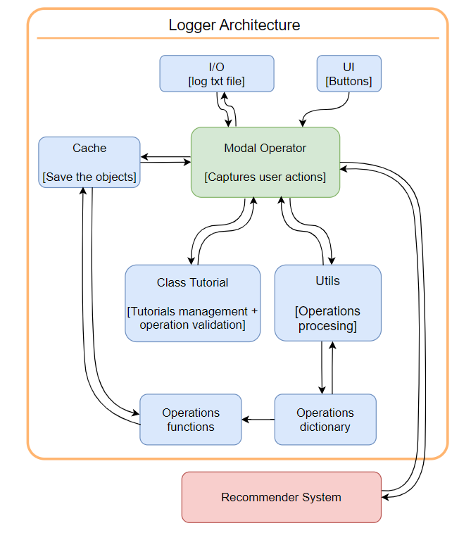

# Index

- [Index](#index)
- [Blender Recommender System](#blender-recommender-system)
  - [Introduction](#introduction)
  - [Project Components](#project-components)
    - [Modal Operator Component](#modal-operator-component)
    - [Tutorial Component:](#tutorial-component)
    - [Utils Component:](#utils-component)
    - [Cache Component:](#cache-component)
    - [Operations Component:](#operations-component)
    - [UI Component:](#ui-component)
    - [IO Component:](#io-component)
    - [Recommender Component:](#recommender-component)
  - [Development Techniques](#development-techniques)
    - [User Action Detection](#user-action-detection)
    - [Efficiency](#efficiency)
    - [Handling Complex Operations](#handling-complex-operations)
  - [Blender Internal Functionality Integration](#blender-internal-functionality-integration)
  - [Conclusion and Future Development](#conclusion-and-future-development)

# Blender Recommender System

**Master's student:** Pier Luigi Nakai Ricchetti

**Professors:** Fabrizio Lamberti (PoliTo), Alberto Cannavò (PoliTo) and Ricardo Nakamura (POLI-USP)

## Introduction

This project is a collaboration between **Politecnico di Torino** with professors Fabrizio Lamberti and Alberto Cannavò (the ones that have proposed the idea) and **Escola Politécnica da USP** with professor Ricardo Nakamura.

The Blender Recommender System is an innovative project designed to enhance the learning experience for students in computer graphics courses utilizing Blender. This 3D modeling software is widely used, and the project aims to provide a virtual intelligent agent, implemented as a Blender python addon, to assist students in their learning journey. The primary objective of the first part of the project is to establish a modular and scalable architecture, offering detailed components to detect user actions, log operations, and prepare data for a universal language to be used by an intelligent recommender system (that will be developed in the second phase of the project).

## Project Components

The architecture can be checked in the image below:



### Modal Operator Component

The Modal Operator Component leverages Blender's modal operators to interactively capture user inputs. In Blender, a modal operator allows continuous interaction with the user, making it ideal for tracking dynamic user actions such as mouse movement and clicks. Utilizing a modal operator ensures continuous monitoring of user actions, providing a robust foundation for operation tracking.

### Tutorial Component:

The Tutorial Component manages all tutorial-related tasks and is initialized by the Modal Operator Component in either Create Tutorial Mode or Load Tutorial Mode.

In **Create Tutorial Mode**, the system tracks all user actions, saving them in a TXT log file. Each step is recorded as an operation performed. This functionality aims to facilitate the creation of new tutorials for professors. The recorded steps can be outputted into a log TXT file, allowing the development of a new component in the future that could read and translate these steps, dynamically presenting them in the Blender UI. Professors could then modify operation values, delete incorrectly captured operations, etc. In the current development stage, this mode already accurately outputs all performed operations in a TXT log file, making it useful for gathering information about the most frequently used operations.

In **Load Tutorial Mode**, a pre-stored tutorial can be loaded. The Tutorial Component utilizes an internal method called "validateStep" to determine if the performed operations are correct according to the next step of the tutorial. It also outputs the progress percentage using the "getProgress" internal method. In the future, the recommender system will make more extensive use of these functions, but for now, the Modal Operator is the primary user.

### Utils Component:

The Utils Component is responsible for managing utility tasks used by other components. These tasks include translating and formatting operations into the software's universal language, verifying if the captured operation by the Modal Component represents a new user action/operation, retrieving all objects in the scene, etc.

### Cache Component:

The Cache Component stores essential information about all objects and modifiers in the scene. Represented as a dictionary (key-value pair), it is accessed by the Operators Component and the Modal Operator Component. Its methods are described using the get/set configuration.

The **Cache Component** makes use of Blender's API performing dynamic updates based on the user's context, storing essential information about all objects and modifiers in the scene.

Represented as a dictionary (key-value pair), it is accessed by the Operators Component and the Modal Operator Component. Its methods are described using the get/set configuration.

By monitoring Blender's mode (object or edit mode), the system intelligently updates the cache, ensuring an accurate and real-time representation of object properties.

*Cache Structure*:

```python
cache = {
    'allObjects': {
        'nameOfObject1': {
            'scale': (x, y, z),
            'location': (x, y, z),
            'rotation': (x, y, z),
            'vertices': {
                'ID1': (x, y, z),
                'ID2': (x, y, z),
                # ... additional vertices
            },
        },
        'nameOfObject2': {
            # ... properties for object 2
        },
        # ... additional objects
    },
}
```

### Operations Component:

This component houses all functions corresponding to their respective operations. It receives an operation and points to the corresponding function to handle the operations appropriately. This is necessary because the way Blender describes each operation can vary significantly. The component is structured as a dictionary, with the key being the operation and the value being a function corresponding to that operation. This structure enhances performance by eliminating the need for multiple if-else statements.

The functions return the performed operations already in the universal language of the developed software, in the following format:

*Operation output examples*:

```python
# Single-value operation
operation_1 = ['Move', (1, 2, 3), 'Object_A']

# Multiple parameters operation
operation_2 = ['Scale', {'factor': 2, 'axis': 'y'}, 'Object_B']

# Complex operation with multiple steps
operation_3 = ['Extrude Region and Move', {'distance': 3, 'axis': 'z'}, 'Object_C']
```

### UI Component:

The UI Component implements all the logic for displaying buttons within the Blender HUD. Currently, there are two simple buttons: "Log User Actions," which initializes the Tutorial Component in "Create Tutorial Mode" to capture all user actions inside Blender, and "Stop Logging Actions," which halts the system and saves all operations performed into a log TXT file.

### IO Component:

The IO Component is responsible for handling the saving of the TXT log in the desired manner. This component ensures that the logged data is stored efficiently and is accessible for future use.

### Recommender Component:

This component is slated for development in the second part of the thesis. It will encompass all the intelligence needed to output information to the user.

## Development Techniques

### User Action Detection

The project employs an intelligent combination of context override and mouse tracking to address the challenge of repeated operations triggered by mouse movements. This strategy ensures accurate tracking and prevents disruption to the user's experience.

Detecting whether new operations were performed by the user presents challenges, particularly when the modal operator component tracks mouse movement. This results in repeated executions, even when no new operation occurs, as the method to extract the last operation from Blender's internal cache is invoked again. Addressing this issue involves using context override to extract information from the "info" area in the Blender user interface.

Every time a new operation happens, a new line appears in the "info" area, describing the user's chosen properties and values. However, accessing these values requires the "info" area to be open in the Blender HUD, which may seem impractical. Context override comes to the rescue by allowing the replacement of an already opened area with the "info" area and then swiftly switching back to the previous area. Mouse tracking helps identify the active area, preventing interference with the user experience.

Despite initial concerns about performance, extensive testing demonstrates the efficiency of this method, handling up to 1000 operations copied from the "info" area without compromising system performance.

However, challenges arise when replacing an area the user is actively using, as it may disable user clicks. To overcome this, mouse tracking, combined with information on the widths and heights of all areas on the screen, determines the active area. The length of operations gathered from the "info" area represents the total operations in the Blender session, aiding in inferring the number of new operations. If the lengths are equal, no new operations occurred.

One notable challenge involves handling user actions not internally computed by Blender, such as CTRL+Z, changes in view mode (top, left, orthogonal, etc.), and similar interactions. Despite these challenges, the combination of context override and mouse tracking proves effective in capturing and tracking user operations while preventing unnecessary repetition.

### Efficiency

The project prioritizes efficiency, evident in the seamless replacement of active areas within Blender's interface and the use of complex dictionary structures. Context override and mouse tracking work in harmony to minimize disruption, even in scenarios where user actions, such as CTRL+Z or view mode changes, may not be internally computed by Blender.

### Handling Complex Operations

In intricate operations comprising multiple steps, property retrieval involves extracting information from the "info" area using a logic adept at successfully extracting relevant data. A notable example is the "Extrude Region and Move" operation, where the intricacy lies in Blender internally calculating it as two simultaneous operations: Extrude and Move.

Using only "bpy.context.active_operator" to retrieve properties would result in obtaining only the last operation computed, leading to the loss of properties associated with the other operation. To circumvent this limitation, the operation is extracted from the "info" area. This approach enables not only the retrieval of properties involved in the first operation but also those associated with the second one. Consequently, the logic employed ensures accurate handling of complex operations, preserving the properties of each step in the process.

## Blender Internal Functionality Integration

The project leverages an understanding of Blender's internal functionality to navigate challenges and enhance system capabilities. For example, distinguishing between object and edit modes, and dynamically updating the cache based on the context, showcases a deep integration with Blender's core functionalities.

## Conclusion and Future Development

The comprehensive analysis of the project components, data structures, and development techniques highlights the depth and sophistication of the **Blender Recommender System**. As the project progresses, the foundation laid in the first part provides a solid platform for the development of an intelligent recommender system in the second phase. 
