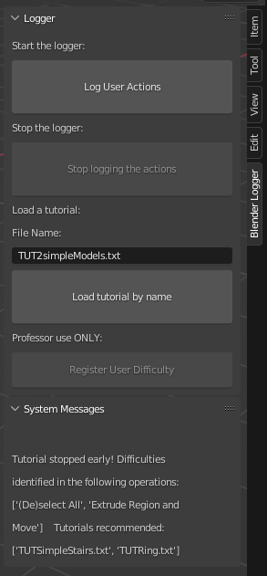
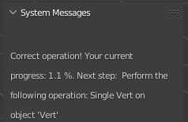
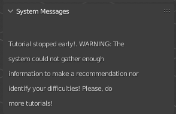
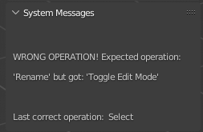
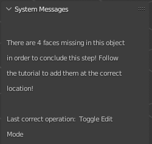
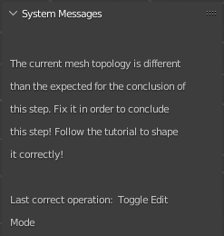

# Index

- [Index](#index)
- [Blender Recommender System](#blender-recommender-system)
  - [What it does](#what-it-does)
  - [Repository layout](#repository-layout)
- [Installation](#installation)
- [Usage](#usage)
  - [1. Opening a project](#1-opening-a-project)
  - [2. The "Blender Logger" panel](#2-the-blender-logger-panel)
  - [3. Log User Actions — creating a new tutorial](#3-log-user-actions--creating-a-new-tutorial)
  - [4. Load tutorial by name — following a tutorial](#4-load-tutorial-by-name--following-a-tutorial)
  - [5. Register User Difficulty — instructor-only override](#5-register-user-difficulty--instructor-only-override)
  - [6. Resetting a learner / regenerating tutorial weights](#6-resetting-a-learner--regenerating-tutorial-weights)
- [System Messages](#system-messages)
  - [Tutorial progress feedback](#tutorial-progress-feedback)
  - [Error feedback (wrong operation / wrong mesh)](#error-feedback-wrong-operation--wrong-mesh)
  - [Operator errors (Blender status bar)](#operator-errors-blender-status-bar)
- [System Architecture](#system-architecture)
- [Recommender Algorithm](#recommender-algorithm)
  - [Tutorial representation (TF-IDF)](#tutorial-representation-tf-idf)
  - [Learner profile update (Rocchio)](#learner-profile-update-rocchio)
  - [Ranking (cosine similarity)](#ranking-cosine-similarity)
- [`highlightVertices` — the disabled "ghost vertices" visual aid](#highlightvertices--the-disabled-ghost-vertices-visual-aid)
  - [Why it is disabled](#why-it-is-disabled)
  - [How it works](#how-it-works)
  - [Recommendation](#recommendation)
- [Legacy / exploratory scripts](#legacy--exploratory-scripts)
- [Reference](#reference)

# Blender Recommender System

**Master's student:** Pier Luigi Nakai Ricchetti

**Professors / co-authors:** Fabrizio Lamberti (PoliTo), Alberto Cannavò (PoliTo), Roberta Macaluso (PoliTo) and Ricardo Nakamura (POLI-USP)

This project is a collaboration between **Politecnico di Torino** (professors Fabrizio Lamberti and Alberto Cannavò) and **Escola Politécnica da USP** (professor Ricardo Nakamura). It started as a master's thesis and later became the basis of the peer-reviewed paper *"An In-Tool Recommender System for Computer Graphics Education with Real-Time Learner Profiling"* (Cannavò, Macaluso, Ricchetti, Lamberti), included in this repository at [paper/t_blender_teaching__TLT_.pdf](paper/t_blender_teaching__TLT_.pdf). **This README documents the system as validated in that paper** — read it first for the full motivation, related work, and the results of the 26-participant user study.

## What it does

The Blender Recommender System (**BRS**) is a Blender add-on that acts as an in-tool Educational Recommender System (ERS) for Computer Graphics / 3D-modeling courses. While a learner works through a modeling tutorial inside Blender, the add-on:

1. **Monitors** every action the learner performs (operators, property changes, mode switches, mesh edits) directly through Blender's own APIs — no external logging or screen recording involved.
2. **Validates** each action against the expected step of the loaded tutorial, giving **immediate, continuous feedback** ("Correct!", "Wrong operation, expected X", "2 vertices missing", etc.) in a dedicated panel.
3. **Builds a learner profile** in the background using a TF-IDF / Rocchio-based content model: every mistake nudges the profile toward the operation the learner struggled with, every correct action nudges it away.
4. Once the tutorial ends, **recommends the two most relevant tutorials** from the library (via cosine similarity between the learner profile and the pre-computed tutorial vectors) to address the learner's specific difficulties.

The same add-on is also used by instructors to **record new tutorials** simply by performing the modeling steps once inside Blender — no manual scripting of tutorial files is needed.

## Repository layout

| Path | Purpose |
|---|---|
| [completeVersion.py](completeVersion.py) | **The add-on.** The only file you need to install in Blender — see [Installation](#installation). |
| [tf-idf.py](tf-idf.py) | Standalone script that (re)computes the TF-IDF weights of every tutorial in `blenderProject/` and writes `termWeights.txt`. Run it whenever tutorials are added, removed, or re-recorded. |
| [blenderProject/](blenderProject/) | The tutorial library: one `.blend` scene + one `TUT*.txt` step file per tutorial, plus `termWeights.txt` and `user_profile.txt` (see below). |
| [paper/](paper/) | The published paper behind this project. |
| [Diagrams/](Diagrams/) | Function-level flowcharts produced during development, organized per component (`ModalOperator/`, `OperationProcessor/`, `Tutorial/`, `MeshProcessor/`, `Recommender/`, `Utils/`, `UI/`), plus real screenshots of the panel under `ModesOfOperation/`. Useful as a deeper reference, but treat `completeVersion.py` as the source of truth since some diagrams predate later revisions. |
| [tutorialMaterials/](tutorialMaterials/) | PDF write-ups of the tutorials used to record the `.blend`/`TUT*.txt` pairs in `blenderProject/`. |
| [loggerVersion.py](loggerVersion.py), [recommenderVersion.py](recommenderVersion.py), [UniversalTranslator.py](UniversalTranslator.py), [TestPerformanceVertices.py](TestPerformanceVertices.py) | **Not part of the add-on.** Early standalone scripts used to prototype/test individual pieces of functionality (operation logging, the recommender math, operator-string translation, vertex-diff performance) in isolation before they were merged into `completeVersion.py`. Kept for historical reference only. |

# Installation

The add-on was built and validated against **Blender 3.3.3** (see `bl_info` at the top of [completeVersion.py](completeVersion.py)). Using a different Blender version may require adjusting a few API calls.

1. Open Blender.
2. Go to **Edit > Preferences > Add-ons > Install...**
3. In the file browser, double-click **`completeVersion.py`**.
4. Back in the Add-ons list, find "**Blender Recommender System**" and **enable it** (tick the checkbox) — installing alone does not activate it.

# Usage

## 1. Opening a project

Do not run the add-on on an arbitrary/blank Blender file. Open one of the `.blend` files inside [blenderProject/](blenderProject/) (or create a new one **inside that same folder**, see step 3) — the add-on resolves `termWeights.txt`, `user_profile.txt`, tutorial `.txt` files, and its output logs as paths **relative to the currently open `.blend` file**, so they must live next to it.

## 2. The "Blender Logger" panel

Once enabled, a new tab called **"Blender Logger"** appears in the 3D Viewport sidebar (press `N` if the sidebar is hidden). It has two sections:

|  |
|:--:|
| *Logger controls (top) and System Messages (bottom).* |

- **Logger** section — four controls:
  - **Log User Actions**
  - **Stop logging the actions**
  - **File Name** field + **Load tutorial by name**
  - **Register User Difficulty** ("Professor use ONLY")
- **System Messages** section — read-only feedback area described in [System Messages](#system-messages).

## 3. Log User Actions — creating a new tutorial

Use this mode to record a brand-new tutorial for the library.

1. Create a **new** `.blend` file and **save it inside `blenderProject/`** before starting the logger (the folder is used to resolve output paths, so an unsaved file has nowhere to write to).
2. Click **Log User Actions**. Every operator, mesh edit and property change you perform from now on is captured and translated into the add-on's internal step format.
3. Perform the tutorial steps exactly as you want the learner to reproduce them.
4. Click **Stop logging the actions**. This writes (or **overwrites**) `blenderProject/logger_log.txt` with the recorded steps.
5. **Rename `logger_log.txt`** to the name you want the tutorial to have (e.g. `TUTMyNewTutorial.txt`) — otherwise the next recording session will overwrite it. Tutorial files must start with `TUT` to be picked up by `tf-idf.py` (see [step 6](#6-resetting-a-learner--regenerating-tutorial-weights)).

## 4. Load tutorial by name — following a tutorial

1. Type the tutorial's file name in the **File Name** field, **exactly** as it appears in `blenderProject/`, including the `.txt` extension (e.g. `TUTBevel.txt`).
2. Click **Load tutorial by name**.
3. The **System Messages** panel starts showing the current step to perform and continuous feedback on every action (see the next section for the full catalogue of messages).
4. When the last step is validated, the panel shows the learner's most frequent difficulties and the two recommended tutorials (or a warning if not enough data was collected — e.g. a learner who completed the tutorial with zero mistakes).

## 5. Register User Difficulty — instructor-only override

While a tutorial is running, if a learner is completely stuck on the current step and an instructor has to demonstrate the correct action for them, click **Register User Difficulty** *before* demonstrating. Without it, the demonstrated (correct) action would be logged as if the learner had performed it flawlessly, hiding a real difficulty from the profile. This button manually counts the current step against the learner (with double the weight of a normal mistake) without altering tutorial validation itself.

## 6. Resetting a learner / regenerating tutorial weights

- **`blenderProject/user_profile.txt`** stores the learner-difficulty vector accumulated across tutorial sessions (the Rocchio profile, see [Recommender Algorithm](#recommender-algorithm)). **Delete this file** to simulate a brand-new learner — the add-on re-initializes the profile to all zeros the next time a tutorial is loaded.
- **`blenderProject/termWeights.txt`** stores the pre-computed TF-IDF weight vector of every tutorial in the library. It is loaded once at the start of every tutorial run. **Whenever you add, remove, or re-record a tutorial**, re-run [tf-idf.py](tf-idf.py) (`python tf-idf.py`, executed from a location where `blenderProject/` is a sibling folder) to regenerate this file — otherwise new tutorials won't be scored/considered for recommendation, and stale ones may still be recommended.

# System Messages

All feedback is written to `bpy.context.scene.user_feedback` through `update_user_feedback()` and rendered by the `RecommenderMessages` panel (`split_text()` wraps the text and turns the internal `!lastcorrect:` marker into a "Last correct operation: ..." line — visible in the screenshots below). Table I of the paper documents a representative subset; the full catalogue actually implemented in `completeVersion.py` is reproduced here.

## Tutorial progress feedback

| When | Message (verbatim) |
|---|---|
| Tutorial just loaded | `First step:  Perform the following operation: <op> on object '<obj>'` |
| Step validated correctly | `Correct operation! Your current progress: <pct> %. Next step:  Perform the following operation: <op> on object '<obj>'` |
| Tutorial completed, enough data | `Tutorial Completed! Difficulties identified in the following operations: [...]    Tutorials recommended: [...]` |
| Tutorial completed, not enough data | `Tutorial Completed!. WARNING: The system could not gather enough information to make a recommendation nor identify your difficulties! Please, do more tutorials!` |
| Logger stopped mid-tutorial, enough data | `Tutorial stopped early! Difficulties identified in the following operations: [...]    Tutorials recommended: [...]` |
| Logger stopped mid-tutorial, not enough data | `Tutorial stopped early!. WARNING: The system could not gather enough information to make a recommendation nor identify your difficulties! Please, do more tutorials!` |
| Difficulty manually flagged (appended to current message) | `... \| User difficulty registered for operation: <op>` |

|  |  |
|:--:|:--:|
| *Correct operation, with live progress %.* | *Tutorial stopped early with insufficient data to profile the learner.* |

## Error feedback (wrong operation / wrong mesh)

| When | Message (verbatim / pattern) |
|---|---|
| Wrong operator performed | `WRONG OPERATION! Expected operation: '<expected>' but got: '<got>'` |
| Wrong operator, with a specific property mismatch | `WRONG OPERATION! Expected value <x> but got <y>. Operation = <expected>` |
| Object/mesh has more or fewer vertices than the last known-correct state | `ERROR FOUND! There is/are <n> vertex/vertices missing/additional in this object. Be sure to add/delete <it/them/the correct one/ones> so the tutorial can continue!` |
| Same, for faces | `ERROR FOUND! There is/are <n> face(s) missing/additional in this object...` |
| Mesh is in the right vertex/face **count** but the expected step needs more/fewer still | `There is/are still <n> vertex/vertices/face(s) missing/additional in this object in order to conclude this step! Follow the tutorial to add/delete <it/them> at the correct location!` |
| Same vertex/face count as expected, but positions/topology differ | `The current mesh topology is different than the expected for the conclusion of this step. Fix it in order to conclude this step! Follow the tutorial to shape it correctly!` |

Whenever an error message is shown, if a correct operation had already been recognized earlier in the tutorial, the panel appends a **`Last correct operation: <op>`** line so the learner can re-orient without losing their place.

|  |  |  |
|:--:|:--:|:--:|
| *Wrong operator.* | *Vertex/face count discrepancy.* | *Same count, wrong topology/shape.* |

## Operator errors (Blender status bar)

These are raised via Blender's own `self.report(...)` mechanism (shown in Blender's status bar / Info log, **not** the System Messages panel):

| Operator | Condition | Message |
|---|---|---|
| Load tutorial by name | File name field does not match a file in `blenderProject/` | `File does not exist at the specified path.` |
| Log User Actions | No active object in the scene when the logger starts | `No active object, could not finish` |
| Register User Difficulty | Clicked while there is no current tutorial step (logger not in tutorial mode) | `No correct operation name found to register difficulty.` |

# System Architecture

The paper (Section IV) describes the add-on as eight cooperating components; the table below maps each one to the actual code in `completeVersion.py`.

| Component (paper) | Responsibility | Code |
|---|---|---|
| **Interaction Monitor** | Continuously listens to Blender events (clicks, drags, mode changes) via a modal operator, and decides whether a genuinely *new* user action occurred (vs. e.g. mouse-move noise). | `ModalOperator.modal()`, `isSameOperation()`, `getPerformedOperations()` — the latter briefly repurposes an existing UI area as an `INFO` editor via `bpy.context.temp_override` to read Blender's own operation log, using mouse position to avoid stealing focus from the area the user is interacting with. |
| **Operation Processor** | Translates Blender's raw, inconsistent operator/property representation into the add-on's fixed structured format `[name, properties, target_object]` (plus an additional-info dict for validation, e.g. tolerance). | `formatOperation2()`, `getFilteredOp()` |
| **Cache** | Keeps an up-to-date snapshot of every object's scale/location/rotation/vertices/faces and every modifier in the scene, so the Operation Processor can diff "before vs. after" without expensive re-queries (also needed because Blender's API cannot cleanly query objects that were just added/removed). | `cacheDict`, `saveObjectsOnCache()`, `saveObjectTransformOnCache()`, `saveObjectVerticesOnCache()`, `saveObjectFacesOnCache()`, `saveModifiersOnCache()` |
| **Tutorial** | Owns both modes: recording steps (**Log mode**) and validating the learner's actions step-by-step against a loaded tutorial (**Tutorial mode**), including a small look-ahead window (currently the next 3 candidate mesh states, see `numberOfMeshes` in `validateStep`) so a learner reaching a later valid state through an alternative sequence of operations isn't unfairly marked wrong. | `Tutorial` class — `addTutorialStep()`, `loadTutorialSteps()`, `validateStep()`, `recursiveValidate()`, `validateFinalValues()`, `getProgress()` |
| **Mesh Processor** | Compares two meshes (expected vs. actual) for topological equivalence — first vertex/face counts, then a greedy nearest-neighbor vertex match within a tolerance, then face-adjacency — independent of *how* the learner reached that mesh state. | `checkMeshSimilarity()`, `findVertsDiff()`, `withinMargin()` |
| **Recommender** | Maintains the learner profile vector, updates it after every correct/wrong attempt, and ranks the tutorial library by cosine similarity once the session ends. See [Recommender Algorithm](#recommender-algorithm). | `recommenderSys` class |
| **UI** | Renders the sidebar panel and formats/wraps the feedback text (including the `!lastcorrect:` marker). | `LayoutDemoPanel`, `RecommenderMessages`, `split_text()`, `update_user_feedback()` |
| **Utils** | General-purpose scene helpers reused by every other component (enumerate objects/modifiers, read all vertices/faces of the active mesh, fetch a newly added object's full state, etc.). | `getAllObjects()`, `getAllModifiers()`, `getAllVerticesOfObject()`, `getAllFacesOfObject()`, `getNewObjectInfo()` |

# Recommender Algorithm

BRS treats each tutorial as a "document" whose "words" are Blender **operation names**, and represents both tutorials and the learner as vectors in that same operation space — a content-based filtering (CBF) approach chosen specifically because it works with the small, sparse interaction data typical of a lab session (see the paper's Section II for why collaborative-filtering / deep-learning approaches were ruled out).

## Tutorial representation (TF-IDF)

Computed offline by [tf-idf.py](tf-idf.py) and stored in `blenderProject/termWeights.txt`:

- `tf(op, tutorial) = count(op in tutorial) / max count of any op in that tutorial`
- `idf(op) = log10(N / n_op)`, where `N` is the number of tutorials and `n_op` the number of tutorials containing `op` (with a `+1` correction on `N` when `op` appears in *every* tutorial, to avoid a zero IDF)
- `weight(op, tutorial) = tf * idf`, then each tutorial vector is L2-normalized.

`tf-idf.py` only considers files in `blenderProject/` whose name starts with `TUT`, so a newly recorded tutorial must be renamed to that convention (see [step 3](#3-log-user-actions--creating-a-new-tutorial)) before being included.

## Learner profile update (Rocchio)

The learner profile `P` lives in the same vector space, one dimension per known operation, initialized at `0` (or restored from `user_profile.txt`). Every time a step is validated, `recommenderSys.updateUserProfile()` nudges `P` incrementally with a one-hot vector `e_i` for the involved operation:

- **Wrong attempt on operation `i`:** `P += β · e_i` (`β = 0.5`; doubled to `1.0` when triggered via **Register User Difficulty**)
- **Correct attempt on operation `i`:** `P += γ · e_i` (`γ = -0.5`)

This is the incremental, per-action form of the classic Rocchio relevance-feedback update; summing all increments over a session recovers the batch formulation used in the paper. At recommendation time the profile is clipped to non-negative values and L2-normalized before use.

## Ranking (cosine similarity)

`recommenderSys.makeRecommendation()` computes the cosine similarity (a plain dot product, since both vectors are already normalized) between the normalized learner profile and every tutorial vector in `termWeights.txt`, excluding the tutorial just completed and the two experiment-only tutorials (`TUTExperiment1.txt`, `TUTExperiment2.txt`). The top 2 are returned to the UI, together with the two operations the learner struggled with most (`getUserDifficulties()`), which the panel shows as the rationale for the recommendation.

# `highlightVertices` — the disabled "ghost vertices" visual aid

`completeVersion.py` contains a fully implemented but **currently unused** function, `highlightVertices()` (and its companion `clearHighlights()`), that was **deliberately switched off to keep the system that was validated in the paper's user study limited to textual feedback** (Table I / Fig. 5 of the paper only document text messages). It was never removed because it directly addresses a problem observed repeatedly during the experiment: learners getting stuck on a mesh-topology error (see the ["wrong topology" message](#error-feedback-wrong-operation--wrong-mesh)) with no idea *which* vertex was actually wrong, or where it needed to go.

## Why it is disabled

The only call site left in the code is commented out, in `StartTutorial.execute()`:

```python
# highlightVertices("Cube", {0: [0,0,0]}, {0: [0,0,1]})
```

## How it works

`highlightVertices(objectName, firstPos, secondPos, tolerance=0.1)` takes two `{vertex_index: [x, y, z]}` dictionaries — the vertex positions *before* and *after* the change a tutorial step expects — and spawns small, non-mesh **Empty** objects (spheres, `show_in_front=True`, radius `0.03`) as visual "ghost" markers at the relevant coordinates, offset into world space by the target object's own location. These empties are pure visual gizmos: they don't touch the real mesh, aren't selectable geometry, and are named so `clearHighlights()` can find and remove them later by suffix.

```
                         highlightVertices(objectName, firstPos, secondPos, tolerance)
                                              |
                        compare len(firstPos) vs len(secondPos)
                                              |
              +---------------------+--------+---------+---------------------+
              |                     |                                        |
     same length ("normal")   fewer in firstPos ("add")            more in firstPos ("delete")
              |                     |                                        |
   for each shared vertex     findVertsDiff(first, second)          findVertsDiff(first, second)
   key, spawn 2 ghosts:       -> positions only in "second"         -> positions only in "first"
   - "<id>: Initial Pos"      (i.e. truly new points)               (i.e. points that must go)
     @ firstPos[id]                    |                                     |
   - "<id>: Final Pos"        spawn 1 ghost per point:              spawn 1 ghost per point:
     @ secondPos[id]          "<i>: Add new vert"                   "<i>: Remove this vert"
              |                     |                                        |
              +---------------------+--------+---------------------+---------+
                                              |
                        restore original selection / active object / mode
                                              |
                             set ignoreLastOp = True (see note below)
```

- **"normal" case** (same vertex count — e.g. a Move/Extrude on existing vertices): for every tracked vertex, draws **two** ghosts — one at its current position, one at where it should end up — so the learner can visually connect the dots between "where I am" and "where I should be", instead of decoding raw coordinates from an error message.
- **"add" case** (`secondPos` has more entries — new geometry expected): `findVertsDiff()` performs a greedy nearest-neighbor match (within `tolerance`) between the two position lists — the same technique used by the Mesh Processor to compare full meshes — to isolate the position(s) present in `secondPos` but not in `firstPos`, and marks each one **"Add new vert"**.
- **"delete" case** (`firstPos` has more entries): symmetric to the above — isolates the position(s) that must disappear and marks each one **"Remove this vert"**.
- Because spawning empties and toggling modes are themselves recorded by Blender as operators, the function finishes by setting the global `ignoreLastOp = True`, which tells `isSameOperation()` to skip its next check — otherwise the highlighting action itself could be misinterpreted as an (incorrect) user action and corrupt the learner profile.
- `clearHighlights()` removes every empty whose name ends in `Initial Pos`, `Final Pos`, `Add new vert` or `Remove this vert` — meant to be called before drawing a new set of ghosts, or once the step is resolved.

## Recommendation

Re-enabling this would give the "wrong topology" / "missing vertex" family of [error messages](#error-feedback-wrong-operation--wrong-mesh) a visual counterpart instead of leaving the learner to reconstruct the correct shape from text alone — a concrete gap observed during the study. A reasonable integration point is inside `Tutorial.validateStep()` / `validateFinalValues()`: call `clearHighlights()` at the start of a new step, then, when a mesh-related validation fails, call `highlightVertices()` using the last known-correct vertex positions from the Cache (`getObjectsOnCache()[objName]["vertices"]`) as `firstPos` and the target step's `"vertices"` field as `secondPos`. Since the plumbing (position diffing, ghost spawning/cleanup, and the `ignoreLastOp` safeguard) already exists and is self-contained, this is mostly a matter of deciding *when* to trigger it and re-running the validated study's protocol (or a follow-up study) with it turned on.

# Legacy / exploratory scripts

`loggerVersion.py`, `recommenderVersion.py`, `UniversalTranslator.py` and `TestPerformanceVertices.py` are early, standalone prototypes used to test individual pieces of functionality (action logging, the recommender math, translating Blender's raw operator strings, and vertex-diff performance, respectively) in isolation, before everything was consolidated into `completeVersion.py`. They are **not** maintained and **not** the add-on to install — kept only as a historical record of how the system evolved.

# Reference

Cannavò, A., Macaluso, R., Ricchetti, P. L. N., & Lamberti, F. *"An In-Tool Recommender System for Computer Graphics Education with Real-Time Learner Profiling."* Full text: [paper/t_blender_teaching__TLT_.pdf](paper/t_blender_teaching__TLT_.pdf).
